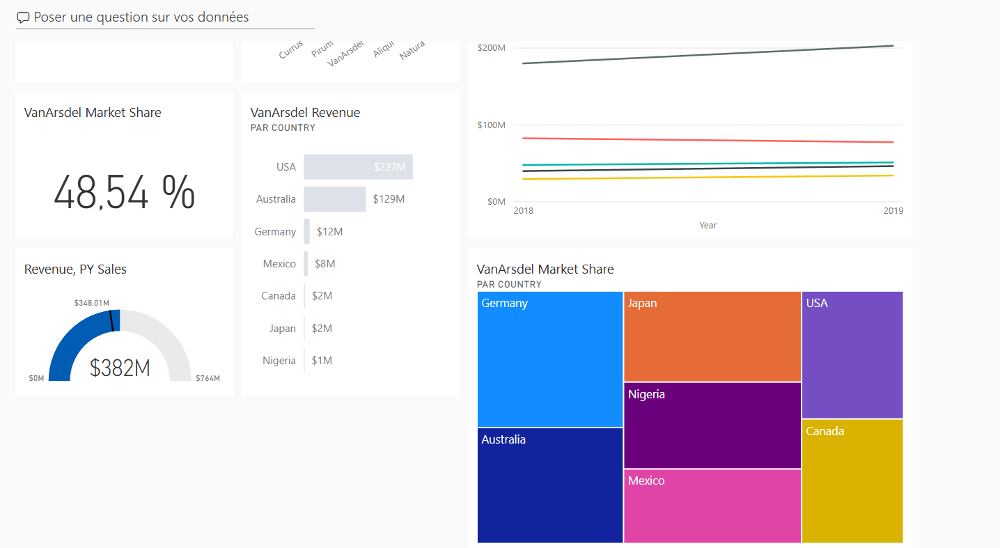

📊 Projet Power BI : Analyse de la Performance Commerciale (VanArsdel)

Ce dépôt présente la conception et la réalisation d'un tableau de bord analytique sous Power BI, réalisé pour évaluer la performance commerciale et la part de marché d'une entité (VanArsdel) sur différentes zones géographiques.

⚠️ **Note de confidentialité :** Ce rapport est hébergé sur le Service Power BI privé et n'est pas accessible publiquement pour des raisons de confidentialité des données. Les captures d'écran ci-dessous attestent du résultat final, et les sections de code M/DAX détaillent la méthodologie technique.

## I. Résultat Visuel (Aperçu)

Ce visuel permet une vue rapide sur la part de marché globale, le chiffre d'affaires, et la distribution des revenus par pays.


## II. Indicateurs Clés et Mesures (DAX)

Les indicateurs (KPIs) suivants ont été conçus pour répondre aux questions business sur la performance :

| KPI | Description | Fonction Business |
| :--- | :--- | :--- |
| **VanArsdel Market Share** | Représente la part de marché globale de l'entreprise (ici, 48.54% sur l'exemple). | Évaluation de la position concurrentielle. |
| **VanArsdel Revenue (par pays)** | Détaille les revenus générés par les produits/services dans différentes régions (USA, Australie, Allemagne, etc.). | Identification des marchés à forte valeur. |
| **Revenue, PY Sales** | Comparaison visuelle du revenu actuel vs. le revenu de l'année précédente (PY Sales). | Mesure de la croissance annuelle. |
| **Tendance Annuelle** | Graphique en ligne montrant l'évolution des revenus des différentes gammes de produits sur plusieurs années. | Analyse de la stratégie de produits et de la saisonnalité. |

---

## III. Preuves d'Expertise Technique

Mon rôle a couvert le cycle complet : de la connexion des sources de données à la création des modèles analytiques.

### 1. **Code M (Power Query) : Préparation et Nettoyage de Données (ETL)**

* J'ai utilisé Power Query pour **extraire, nettoyer et transformer** les données sources avant le chargement dans le modèle.
* *Exemple d'une étape de transformation (Code M) :*

    ```markdown
    // Code M pour l'étape de nettoyage et de typage
    let
        Source = Csv.Document(File.Contents("Data/source_ventes.csv"),[Delimiter=",", Encoding=1252, QuoteStyle=QuoteStyle.None]),
        #"En-têtes Promus" = Table.PromoteHeaders(Source, [PromoteAllScalars=true]),
        #"Colonnes Renommées" = Table.RenameColumns(#"En-têtes Promus",{{"Date", "Date_Vente"}, {"Montant", "Montant_HT"}}),
        #"Types Modifiés" = Table.TransformColumnTypes(#"Colonnes Renommées",{{"Date_Vente", type date}, {"Montant_HT", type number}})
    in
        #"Types Modifiés"
    ```
    [cite_start]*(Ce code illustre la transformation des types de données et le renommage pour assurer la qualité des données à la source [cite: 65, 66]).*

### 2. **Code DAX : Création de Mesures et Calculs Complexes**

* J'ai développé des mesures en **DAX (Data Analysis Expressions)** pour créer des indicateurs non présents dans les données brutes.
* *Exemple d'une mesure complexe (DAX) :*

    ```markdown
    // Mesure de la Part de Marché (Market Share)
    Market Share = 
        DIVIDE(
            SUM('FactSales'[Revenue]), 
            CALCULATE(
                SUM('FactSales'[Revenue]),
                ALL('DimProduct')
            )
        )

    // Mesure pour l'Année Précédente (Previous Year Sales)
    PY Sales = 
        CALCULATE(
            SUM('FactSales'[Revenue]),
            SAMEPERIODLASTYEAR('DimDate'[Date])
        )
    ```

### 3. **Modélisation (Conception du Schéma)**

* [cite_start]J'ai mis en place un **modèle de données en étoile** (Star Schema) pour optimiser les performances des requêtes analytiques[cite: 62].
* J'ai utilisé des relations entre la table de faits (Ventes/Revenue) et les dimensions (Pays, Produit, Temps).
